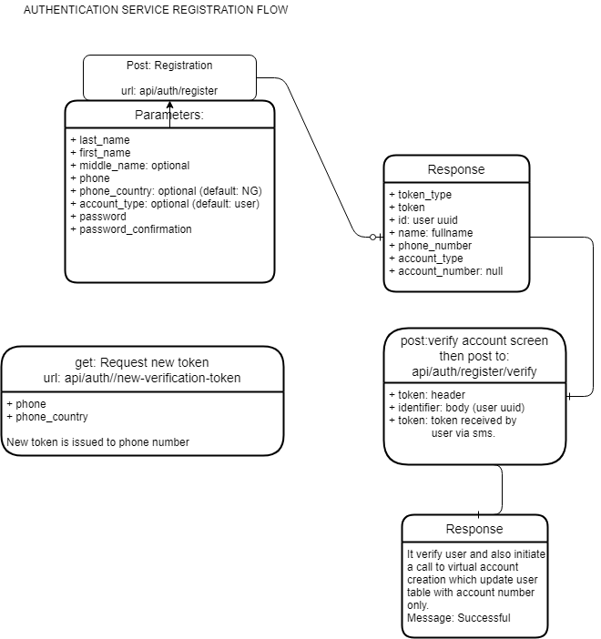

# Authentication API Service

## PHP Version use:: 8.0

### To run swagger documentation:
- command: php artisan l5-swagger:generate
- route: /documentation example: localhost/api/documentation

### Diagrams

